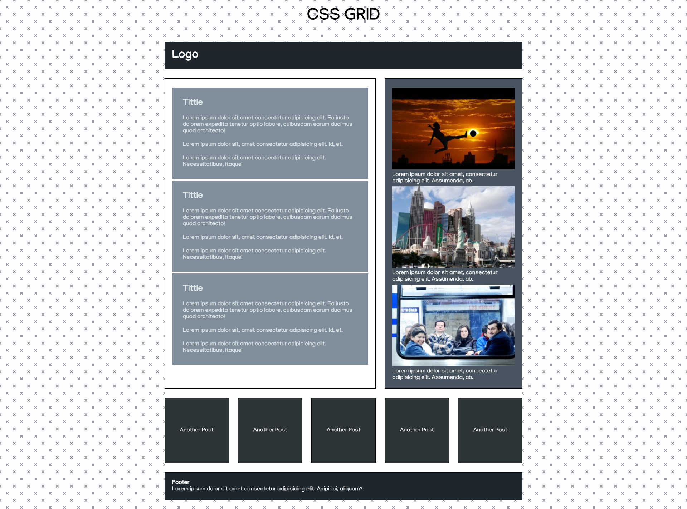

# CSS-Grid Example
This is my first css-grid example

## Me
_Hi everyone, i'm David, and this is my first example using css-grid_

# Resources
- https://www.heropatterns.com/
- https://www.w3schools.com/css/css_rwd_mediaqueries.asp
- https://www.youtube.com/watch?v=VmHO_AjxHnQ
